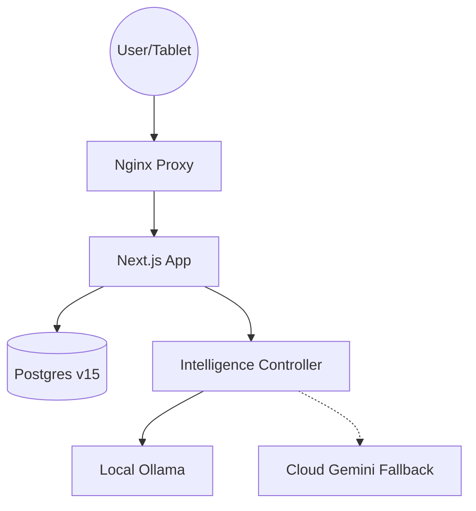

# Intake System V3: Enterprise Production Stack

This version elevates the self-hosted V2 architecture to enterprise-grade maturity with a focus on resilience, observability, and data integrity.

## V3 Key Advancements

- **Intelligence Controller**: Explicit Ollama-to-Gemini failover with local-only enforcement for PHI-sensitive clinical data.
- **Infrastructure Hardening**: Nginx reverse proxy, Docker health checks for all services, and explicit CPU/RAM resource limits.
- **Persistence Optimization**: Parallelized domain hydration updates reducing latency from O(N) to O(1) round-trips.
- **Clinical Integrity**: Atomic narrative-to-barrier promotion via PostgreSQL RPC.
- **Enterprise Observability**: Structured JSON logging and automated database backup strategy.
- **PWA Polish**: Optimized manifest for standalone Android tablet deployment in clinical workflows.

## Setup Instructions

### Linux (V3)

```bash
chmod +x scripts/setup_v3.sh
./scripts/setup_v3.sh
```

### Backups

```bash
./scripts/backup.sh
```

## Architecture Summary


