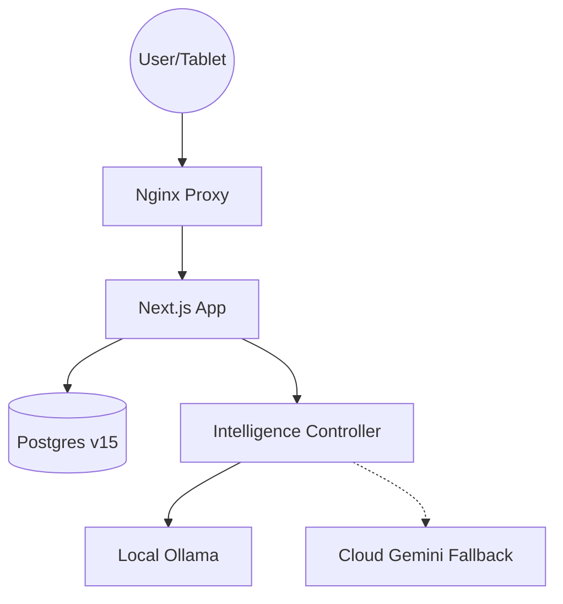

# Intake System V3: Enterprise Production Stack

This version elevates the self-hosted V2 architecture to enterprise-grade maturity with a focus on resilience, observability, and data integrity.

## V3 Key Advancements

- **Intelligence Controller**: Explicit Ollama-to-Gemini failover with local-only enforcement for PHI-sensitive clinical data.
- **NextAuth + Prisma Stack**: Replaced Supabase Auth/RLS with secure NextAuth sessions and Prisma ORM for type-safe database access.
- **Unified Auditing**: Centralized `AuditService` logging all resource-level changes to a dedicated audit trail.
- **Infrastructure Hardening**: Nginx reverse proxy, Docker health checks, and explicit resource limits.

## Setup Instructions

### Database & Environment

1. **Config**: Set your `DATABASE_URL` in `prisma/.env`.
2. **Client**: Generate the Prisma client:
   ```bash
   npx prisma generate
   ```
3. **Migrate**: Push the schema to your NAS-hosted Postgres:
   ```bash
   npx prisma migrate deploy
   npx prisma db seed
   ```

### Execution (V3)

```bash
chmod +x scripts/setup_v3.sh
./scripts/setup_v3.sh
```

### Backups

```bash
./scripts/backup.sh
```

## Architecture Summary


