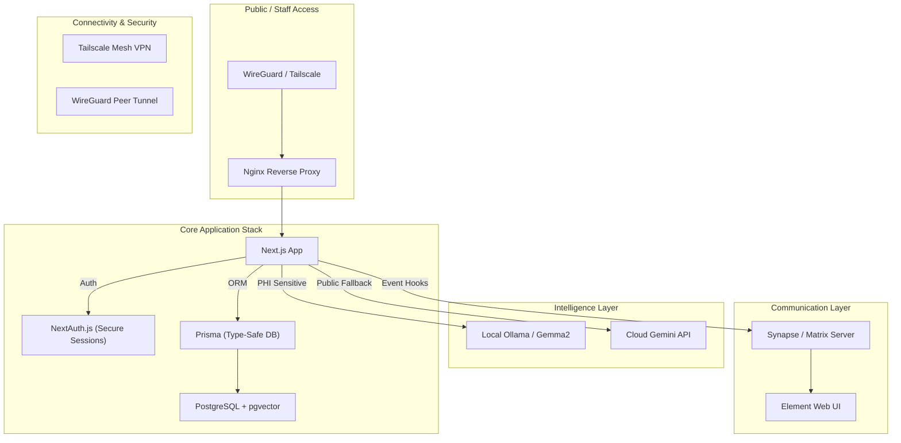

# 🌐 Unified Intake System V3: Full Stack Overview

This document provides a high-level map of the entire ecosystem, integrating core clinical logic, secure communications, AI intelligence, and hardened networking.

---

## 🏗️ 1. Multi-Service Architecture

The system is deployed via **Docker Compose**, orchestrating a suite of specialized services designed for clinical resilience.



---

## 🛠️ 2. Service Catalog

### **Core Stack**
- **Next.js (App)**: The primary engine. Uses **Server Actions** for all data mutations to eliminate client-side Supabase keys.
- **Prisma**: Handles all database schema management and type-safe queries.
- **NextAuth**: Manages user authentication and role-based session state (`admin`, `supervisor`, `staff`).
- **Postgres + pgvector**: Stores clinical data and vector embeddings for RAG-based clinical memory. **pgvector** is essential for the Clinical Memory and Semantic Search features.

### **Clinical Intelligence**
- **Ollama**: Hosted locally on the NAS to process Medical/PHI-sensitive data without cloud exposure.
- **Gemini**: Used as a high-performance fallback for non-PHI tasks like general report summarizing.

### **Communication Hub**
- **Matrix (Synapse)**: A decentralized, end-to-end encrypted messaging server for internal clinical coordination.
- **Element**: The web-based client for interacting with the Matrix server.

### **Connectivity (Networking)**
- **Tailscale**: Provides a Zero-Config mesh network for connecting NAS nodes and development machines securely.
- **WireGuard**: A high-performance point-to-point tunnel for staff accessing the system from remote clinical tablets.

---

## 🚦 3. Deployment & Verification

### **Configuration**
All services are defined in:
- `docker-compose.yml` (Standard/Local)
- `docker-compose.nas.yml` (Production/NAS Hardened)

### **Setup Command Chain**
```bash
# 1. Environment Config
cp .env.example .env

# 2. Database Sync
npx prisma generate
npx prisma migrate deploy

# 3. Stack Launch
docker compose -f docker-compose.nas.yml up -d --build
```

---

## 📜 4. Core Documentation Links
- **[QUICKSTART.md](file:///c:/Users/keith/Desktop/Intake/intake-system-4.1-Edge-RAG-Release/QUICKSTART.md)**: Immediate path to running the app.
- **[STARTUP.md](file:///c:/Users/keith/Desktop/Intake/intake-system-4.1-Edge-RAG-Release/STARTUP.md)**: Deep dive into service initialization and troubleshooting.
- **[README_V3.md](file:///c:/Users/keith/Desktop/Intake/intake-system-4.1-Edge-RAG-Release/README_V3.md)**: Highlights of the V3 architecture advancements.
- **[DEPL_BLUEPRINT.md](file:///c:/Users/keith/Desktop/Intake/intake-system-4.1-Edge-RAG-Release/docs/deployment_blueprint.md)**: Logic for replication and state-sync between nodes.
