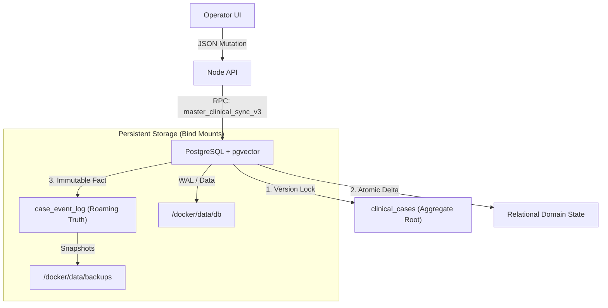

# 🏗️ Production Deployment Blueprint (v3.2)

### For Technical Architects & DevOps Engineers

This blueprint details the "Clinical Node" architecture, focusing on reliability, deterministic state, and rapid replication.

---

## 1. System Architecture

The Intake system is designed as a **Self-Contained State Machine**. Every node is functionally identical and can recover the entire domain state from the immutable event log.

---

## 2. Replication Strategy (The "Roaming Fact")

To spin up a new node with identical state:

1. **Extract**: Export the `case_event_log` from the Source Node.
2. **Restore**: Import the log into a clean Target Node.
3. **Replay**: The Forensic Engine automatically rebuilds the domain tables from the immutable facts.
4. **Result**: Both nodes are bit-identical (Proven via `forensic_state_hash.sh`).

---

## 3. Scaling & Reliability

- **Horizontal Scaling**: Deploy multiple nodes behind a Load Balancer (Nginx/Kong). Use the `case_event_log` as the source of truth for eventual consistency across nodes.
- **Failover**: Postgres is configured with `fsync=on` and `data-checksums`. Even in a hard power cut, the WAL ensures no partial state transitions.
- **Security**: Direct table access is revoked. All mutations **must** pass through the gated sync RPC (Security Definer).

---

## 4. Resource Allocation

- **CPU**: 1 vCPU (Base) / 2 vCPU (AI operations).
- **RAM**: 2GB (Base) / 4-8GB (If running local Ollama/Gemma).
- **Disk**: NVMe/SSD recommended for high-frequency clinical event logging.

---

## 5. Decision Matrix: Cloud vs Local

- **Local (Default)**: Maximum privacy (PHI stays on-prem). Zero latency for local users.
- **Cloud (Hybrid)**: Use Gemini fallback ONLY for non-PHI tasks (e.g., general clinical coding/cleanup).
- **PWA**: Use the PWA for "Instant App" feel on Samsung/Windows laptops without full binary distribution overhead.
